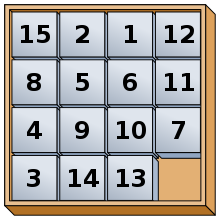
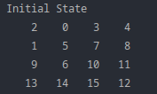
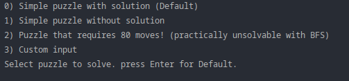
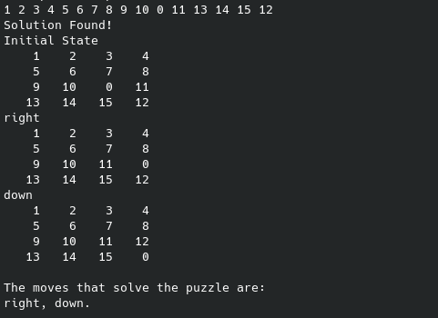

# 15-Puzzle Game

> The 15 puzzle (also called Gem Puzzle, Boss Puzzle, Game of Fifteen, Mystic Square and many others) is a sliding
> puzzle having 15 square tiles numbered 1–15 in a frame that is 4 tiles high and 4 tiles wide, leaving one unoccupied
> tile position. Tiles in the same row or column of the open position can be moved by sliding them horizontally or
> vertically, respectively. The goal of the puzzle is to place the tiles in numerical
> order.[[1]](https://en.wikipedia.org/wiki/15_puzzle)



## The Problem

Write an algorithm that finds the solution to the puzzle. Implement the BFS (Breadth-First-Search) algorithm using
any programming language. If no solution exists output a message stating that.

**Table of Contents**

- [15-Puzzle Game](#15-puzzle-game)
    * [The Problem](#the-problem)
    * [State Representation](#state-representation)
    * [Usage](#usage)
        + [1.Compile](#1compile)
        + [2.Run](#2run)
    * [The Command Line Interface (CLI)](#the-command-line-interface--cli-)
        - [Custom input option](#custom-input-option)
        - [Solution Found Output](#solution-found-output)
    * [The Code](#the-code)
        + [Main.kt](#mainkt)
            - [Example puzzles](#example-puzzles)
            - [CLI Selection](#cli-selection)
            - [Output](#output)
                * [getPath()](#getpath--)
                * [getSolutionStatesString()](#getsolutionstatesstring--)
                * [getSolutionString()](#getsolutionstring--)
        + [State.kt](#statekt)
            - [The State class](#the-state-class)
                * [getEmptyBoxIndexes()](#getemptyboxindexes--)
            - [getAllSubStates()](#getallsubstates--)
            - [isGoalState()](#isgoalstate--)
            - [Solvatibility](#solvatibility)
                * [isSolvable()](#issolvable--)
                    + [getEmptyBoxRowFromBottom()](#getemptyboxrowfrombottom--)
                    + [getInvCount()](#getinvcount--)
            - [Helper Functions](#helper-functions)
                * [.copy()](#copy--)
                * [toString()](#tostring--)
                * [hashCode()](#hashcode--)
                * [equals()](#equals--)
        + [BFS.kt](#bfskt)
            - [bfs()](#bfs--)
                * [This is the Breadth First Search Implementation. I have also included a time-out functionality to it that fires](#this-is-the-breadth-first-search-implementation-i-have-also-included-a-time-out-functionality-to-it-that-fires)

## State Representation

The states are represented by a 2D array with numbers. The empty tile is represented by the number 0.


> An example of a state.

## Usage

### 1.Compile

`$ kotlinc -include-runtime Main.kt State.kt BFS.kt -d Main.jar`

### 2.Run

`$ java -jar Main.jar`

## The Command Line Interface (CLI)

Choose one of the modes.



#### Custom input option

If you have chosen to use a custom puzzle, type your array puzzle in one line, with the elements separated by space like
so:

`$ 2 0 3 4 5 6 7 8 9 6 10 11 13 14 15 12`

#### Solution Found Output



## The Code

### Main.kt

#### Example puzzles

Here I create 3 arrays as examples that the user can use instead of a custom array.

```kotlin
val boardWithSolution = arrayOf(
    intArrayOf(2, 0, 3, 4),
    intArrayOf(1, 5, 7, 8),
    intArrayOf(9, 6, 10, 11),
    intArrayOf(13, 14, 15, 12)
)

val boardWithNoSolution = arrayOf(
    intArrayOf(1, 2, 3, 4),
    intArrayOf(5, 6, 7, 8),
    intArrayOf(9, 10, 11, 12),
    intArrayOf(13, 15, 14, 0)
)

//     Solution for this board exists, but it requires many moves (80 moves),
//     our BFS is not efficient enough to tackle this puzzle and will time out
//     http://kociemba.org/themen/fifteen/fifteensolver.html
val boardWithMaxMovesSolution = arrayOf(
    intArrayOf(0, 12, 9, 13),
    intArrayOf(15, 11, 10, 14),
    intArrayOf(3, 7, 2, 5),
    intArrayOf(4, 8, 6, 1)
)
```

#### CLI Selection

Here I check if the user is going to use one of the example arrays or input his own.

```kotlin
   var choice: String
do {
    println(
        """
            0) Simple puzzle with solution (Default)
            1) Simple puzzle without solution
            2) Puzzle that requires 80 moves! (practically unsolvable with BFS)
            3) Custom input
            Select puzzle to solve. press Enter for Default.
        """.trimIndent()
    )
    choice = readLine()!!
} while (choice != "0" && choice != "" && choice != "1" && choice != "2" && choice != "3")
```

#### Get Solution based on array chosen

Based on the user's answer, I get the solution of the puzzle if it exists. If the user has entered gibberish or an array
that is in an invalid form, I throw an exception.

```kotlin
val solution: State?

when (choice) {
    "0" -> solution = bfs(State(boardWithSolution))
    "1" -> solution = bfs(State(boardWithNoSolution))
    "2" -> solution = bfs(State(boardWithMaxMovesSolution))
    "3" -> {
        println(
            """
                    Enter custom puzzle, values separated by space
                    (example of input: 2 0 3 4 5 6 7 8 9 6 10 11 13 14 15 12)
                """.trimIndent()
        )
        try {
            val c = readLine()!!.split(" ").map { s -> s.toInt() }
            val customPuzzle = arrayOf(
                intArrayOf(c[0], c[1], c[2], c[3]),
                intArrayOf(c[4], c[5], c[6], c[7]),
                intArrayOf(c[8], c[9], c[10], c[11]),
                intArrayOf(c[12], c[13], c[14], c[15])
            )
            solution = bfs(State(customPuzzle))
        } catch (e: Exception) {
            println("Please enter valid custom puzzle")
            throw Exception("Invalid custom puzzle")
        }
    }
    else -> solution = bfs(State(boardWithSolution))

}
```

#### Output

Here I find the path, print the states up until the solution and the moves required to solve the puzzle. I do that by
making use of the helper functions getPath() , getSolutionStatesString() and getSolutionString() respectively.

```kotlin
if (solution != null) {
    println("Solution Found!")
    val path = getPath(solution)

    println(getSolutionStatesString(path))
    println("The moves that solve the puzzle are: ")
    println(getSolutionString(path))

}
```

##### getPath()

```kotlin
private fun getPath(solution: State): Array<State> {
    val path: MutableList<State> = ArrayList()
    var s: State? = solution
    while (s != null) {
        path.add(s)
        s = s.parent
    }
    path.reverse()
    return path.toTypedArray()
}
```

##### getSolutionStatesString()

```kotlin
private fun getSolutionStatesString(path: Array<State>): String {
    val buffer = StringBuilder()
    path.forEach { state ->
        run {
            buffer.append((state.moveDone ?: "Initial State") + '\n')
            buffer.append(state.toString())
        }
    }
    return buffer.toString()
}

```

##### getSolutionString()

```kotlin
private fun getSolutionString(path: Array<State>): String {
    val buffer = StringBuilder()
    for (i in 1 until path.size) {
        if (path[i].isGoalState()) {
            buffer.append(path[i].moveDone + ".\n")
        } else {
            buffer.append(path[i].moveDone + ", ")
        }
    }
    return buffer.toString()
}
```

### State.kt

#### The State class

- boardArr is the array puzzle,
- moveDone is the move done to get to the specific state
- parent is the parent state
- emptyBoxIndexes is a Pair that represents the indexes of the empty tile in the array and are located by the helper
  function getEmptyBoxIndexes()

The root state has always moveDone and parent = null.

```kotlin
class State(
    private val boardArr: Array<IntArray>,
    internal val moveDone: String? = null,
    internal val parent: State? = null
) {
    private val emptyBoxIndexes: Pair<Int, Int> = getEmptyBoxIndexes()
}

```

##### getEmptyBoxIndexes()

Returns the indexes of the empty tile or throws an exception if it doesn't exist.

```kotlin
private fun getEmptyBoxIndexes(): Pair<Int, Int> {
    for (i in boardArr.indices) {
        for (j in boardArr[i].indices) {
            if (boardArr[i][j] == 0) {
                return Pair(i, j)
            }
        }
    }
    throw Exception("Empty box was not found!")
}
```

#### getAllSubStates()

Returns an ArrayList of all the States that can be produced by all the possible moves of the empty tile of a State.

```kotlin
fun getAllSubStates(): ArrayList<State> {

    val subStates: ArrayList<State> = ArrayList()
    var newBoardArr: Array<IntArray>

    // Empty box moves up.
    if (emptyBoxIndexes.first != 0) { // Check if empty box can move up.
        newBoardArr = boardArr.copy()
        newBoardArr[emptyBoxIndexes.first][emptyBoxIndexes.second] =
            newBoardArr[emptyBoxIndexes.first - 1][emptyBoxIndexes.second]
        newBoardArr[emptyBoxIndexes.first - 1][emptyBoxIndexes.second] = 0

        subStates.add(State(newBoardArr, "up", this))
    }

    // Empty box moves down.
    if (emptyBoxIndexes.first != 3) { // Check if empty box can move down.
        newBoardArr = boardArr.copy()
        newBoardArr[emptyBoxIndexes.first][emptyBoxIndexes.second] =
            newBoardArr[emptyBoxIndexes.first + 1][emptyBoxIndexes.second]
        newBoardArr[emptyBoxIndexes.first + 1][emptyBoxIndexes.second] = 0

        subStates.add(State(newBoardArr, "down", this))
    }

    // Empty box moves left.
    if (emptyBoxIndexes.second != 0) {// Check if empty box can move left.
        newBoardArr = boardArr.copy()
        newBoardArr[emptyBoxIndexes.first][emptyBoxIndexes.second] =
            newBoardArr[emptyBoxIndexes.first][emptyBoxIndexes.second - 1]
        newBoardArr[emptyBoxIndexes.first][emptyBoxIndexes.second - 1] = 0

        subStates.add(State(newBoardArr, "left", this))
    }

    // Empty box moves right.
    if (emptyBoxIndexes.second != 3) {// Check if empty box can move right.
        newBoardArr = boardArr.copy()
        newBoardArr[emptyBoxIndexes.first][emptyBoxIndexes.second] =
            newBoardArr[emptyBoxIndexes.first][emptyBoxIndexes.second + 1]
        newBoardArr[emptyBoxIndexes.first][emptyBoxIndexes.second + 1] = 0

        subStates.add(State(newBoardArr, "right", this))
    }

    return subStates
}
```

#### isGoalState()

Creates the Goal State and checks whether our state is equal to the Goal State.

```kotlin
fun isGoalState(): Boolean {

    // Goal board array.
    val goalBoardArr = arrayOf(
        intArrayOf(1, 2, 3, 4),
        intArrayOf(5, 6, 7, 8),
        intArrayOf(9, 10, 11, 12),
        intArrayOf(13, 14, 15, 0)
    )

    if (!boardArr.contentDeepEquals(goalBoardArr)) return false

    return true
}
```

#### Solvatibility

Based on [this](https://www.geeksforgeeks.org/check-instance-15-puzzle-solvable/. "this") article we can find out if a
puzzle is solvable using three parameters, the width of the puzzle the position of the empty tile from the bottom and
the number of inversions.

We can find out if a 15-puzzle is solvable by following these rules:

1. If N is odd, then puzzle instance is solvable if number of inversions is even in the input state.
2. If N is even, puzzle instance is solvable if

- the blank is on an even row counting from the bottom (second-last, fourth-last, etc.) and number of inversions is odd.
- the blank is on an odd row counting from the bottom (last, third-last, fifth-last, etc.) and number of inversions is
  even.

3. For all other cases, the puzzle instance is not solvable.

Where N is the width of puzzle and an inversion is defined like so:

##### What is an inversion?

If we assume the tiles written out in a single row (1D Array) instead of being spread in N-rows (2D Array), a pair of
tiles (a, b) form an inversion if a appears before b but a > b.
For above example, consider the tiles written out in a row, like this:
2 1 3 4 5 6 7 8 9 10 11 12 13 14 15 X
The above grid forms only 1 inversion i.e. (2, 1).

for more examples and illustrations
visit [How to check if an instance of 15 puzzle is solvable?](https://www.geeksforgeeks.org/check-instance-15-puzzle-solvable/ "How to check if an instance of 15 puzzle is solvable?")
.

##### isSolvable()

Applies the rules discussed above and returns true if the state is solvable.

```kotlin
fun isSolvable(): Boolean {
    val invCount = getInvCount()

    // If grid is odd, return true if inversion count is even.
    return if (boardArr.size % 2 != 0) {
        invCount % 2 == 0
    } else {  // If grid is even.
        val emptyBoxRow = getEmptyBoxRowFromBottom()
        if (emptyBoxRow % 2 != 0) {
            invCount % 2 == 0
        } else {
            invCount % 2 != 0
        }
    }

}
```

###### getEmptyBoxRowFromBottom()

```kotlin
private fun getEmptyBoxRowFromBottom(): Int {

    for (i in boardArr.reversedArray().indices) {
        for (j in boardArr[i].reversedArray().indices) {
            if (boardArr[i][j] == 0) {
                return boardArr.size - i
            }
        }
    }
    throw Exception("Empty box was not found!")
}
```

###### getInvCount()

```kotlin
private fun getInvCount(): Int {

    // Flatten boardArr to 1d array.
    val arr = boardArr.flatMap { obj -> obj.toList() }.toTypedArray()

    var invCount = 0
    for (i in arr.indices) {
        for (j in 0 until i) {
            if (arr[j] != 0 && arr[i] != 0) {
                if (arr[j] > arr[i]) invCount++
            }
        }
    }

    return invCount
}
```

#### Helper Functions

##### .copy()

```kotlin
private fun Array<IntArray>.copy() = Array(size) { get(it).clone() }
```

##### toString()

```kotlin
override fun toString(): String {
    val buffer = StringBuilder()

    for (r in boardArr) {
        for (c in r) {
            buffer.append(String.format("%5d", c))
        }
        buffer.append('\n')
    }
    return buffer.toString()
}
```

##### hashCode()

```kotlin
override fun hashCode(): Int {
    return boardArr.contentDeepHashCode()
}
```

##### equals()

```kotlin
override fun equals(other: Any?): Boolean {
    if (this === other) return true
    if (javaClass != other?.javaClass) return false

    other as State

    if (!boardArr.contentDeepEquals(other.boardArr)) return false

    return true
}
```

### BFS.kt

#### bfs()

This is the Breadth First Search Implementation. I have also included a time-out functionality to it that fires
after 15 seconds. I have done this because of the exponential growth of the tree and the fact that there are solutions
that can take up to 80 moves!.

```kotlin
fun bfs(initialState: State): State? {

    // Timeout after 15 seconds
    val start = System.currentTimeMillis()
    val end = start + 15000

    if (initialState.isGoalState()) {
        return initialState
    }
    if (!initialState.isSolvable()) {
        println("This puzzle is not solvable!")
        return null
    }


    val frontier: Queue<State> = LinkedList()
    val visited: MutableSet<State> = HashSet()
    var currentState: State
    var subStates: ArrayList<State>

    frontier.add(initialState)

    while (frontier.size > 0 && System.currentTimeMillis() < end) {

        currentState = frontier.poll()

        visited.add(currentState)

        subStates = currentState.getAllSubStates()

        for (state in subStates) {
            if (frontier.contains(state) || visited.contains(state)) {
                continue
            }
            if (state.isGoalState()) {
                return state
            }
            frontier.add(state)

        }

    }

    println("Timed out!")
    println("Solution exists but BFS will take very long to find it.")
    return null
}
```